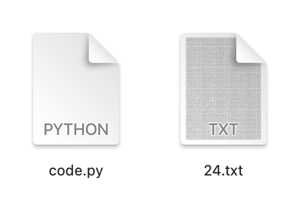

[notebook]: https://mybinder.org/v2/gh/zinkinru/webinar-10032021/master?filepath=zinkin.ipynb

# Материалы к вебинару 3 марта 2021

«Нестандартные алгоритмы решения ЕГЭ 2021 по&nbsp;информатике с&nbsp;помощью компьютера»

ЕГЭ по&nbsp;информатике в&nbsp;2021 году пройдёт в&nbsp;компьютерной форме. В&nbsp;течение всего экзамена ученикам доступен компьютер. На&nbsp;вебинаре ведущий показал классические и&nbsp;нестандартные подходы к&nbsp;решению задач. Эти методы позволяют решить задания в&nbsp;три раза быстрее. Разобрали практические задания.

Вебинар полезен начинающим и&nbsp;опытным репетиторам, которые готовят учеников к&nbsp;сдаче ЕГЭ по&nbsp;информатике.

1. <a href="https://webinar.profi.ru/recordings#rec209148844" target="_blank">Купить запись вебинара</a>
2. [Интерактивный блокнот для запуска кода][notebook]

### Автор — <a href="https://profi.ru/profile/ZinkinAA/" target="_blank">Артём Анатольевич Зинкин</a>

Экспертный уровень ЕГЭ, МЦКО  
Анализирую большие данные и&nbsp;пишу ботов на&nbsp;Python  
Основатель проекта для спортивных программистов <a href="https://olympcode.ru" target="_blank">olympcode.ru</a>

### Программа вебинара

1. Ключевые изменения ЕГЭ по&nbsp;информатике в&nbsp;2021 году
2. Подход к&nbsp;решению задач с&nbsp;учётом изменений
3. Реализация подхода на&nbsp;примере задания 14
4. Методика решения задания 24&nbsp;ЕГЭ по&nbsp;информатике

### Ключевые изменения ЕГЭ по&nbsp;информатике

1. Среда программирования
2. Ответ важнее решения

### Подход к&nbsp;решению

- Программа «Минутка»
- Встроенные функции
- Экзамен не олимпиада

### ЕГЭ номер 14. Прямое сложение в&nbsp;системах счислений&para;

**Задача&nbsp;1.** Значение арифметического выражения: \\(9^{18} + 3^{54} - 9\\) записали в&nbsp;системе счисления с&nbsp;основанием \\(3\\). Сколько цифр &laquo;\\(2\\)&raquo; содержится в&nbsp;этой записи?

[Запустить код][notebook]


```python
# Подробный вариант

n = 9 ** 18 + 3 ** 54 - 9
s = 0

while n != 0:
    if n % 3 == 2:
        s = s + 1
    n = n // 3

print(s)
```

    34


```python
# Короткий вариант

n = 9 ** 18 + 3 ** 54 - 9
s = 0

while n:
    s += n % 3 == 2
    n //= 3

print(s)
```

    34


**Общий вид**

```python
n = выражение
s = 0

while n:
    s += n % основние == цифра
    n //= основание

print(s)
```

**Задача&nbsp;2.** Значение выражения \\(2 * 216^6 + 3 * 36^9 − 432\\) записали в&nbsp;системе счисления с&nbsp;основанием \\(6\\). Сколько цифр \\(5\\) содержится в&nbsp;этой записи?

[Запустить код][notebook]


```python
n = 2 * 216 ** 6 + 3 * 36 ** 9 - 432
s = 0

while n:
    s += n % 6 == 5
    n //= 6

print(s)
```

    14


**Задача&nbsp;3.** Значение выражения \\(216^5 + 6^3 - 1 - X\\) записали в&nbsp;системе счисления с&nbsp;основание \\(6\\), при этом в&nbsp;записи оказалось \\(12\\) цифр \\(5\\). При каком минимальном положительном значении \\(X\\) это возможно?

[Запустить код][notebook]


```python
for x in range(1000):
    n = 216 ** 5 + 6 ** 3 - 1 - x
    s = 0

    while n:
        s += n % 6 == 5
        n //= 6

    if s == 12:
        print(x)
        break
```

    259


### ЕГЭ номер 24. Обработка символьных строк

<center></center>


```python
# технический момент
# файл с кодом и тектовый файл должны быть в одном каталоге

import os
os.chdir("src/txt/")
```

**Задача&nbsp;4.** Текстовый файл состоит не&nbsp;более чем из \\(10^6\\) символов \\(X\\), \\(Y\\) и \\(Z\\). Определите максимальную длину цепочки вида \\(XYZXYZXYZ...\\) (последний фрагмент может быть неполным)

[Запустить код][notebook]


```python
# Классическое решение

file  = open('24.txt').read()

max_count = count = 0

for char in file:
    if (char == 'X' and count % 3 == 0 or 
        char == 'Y' and count % 3 == 1 or 
        char == 'Z' and count % 3 == 2 ):
        count += 1
    elif char == 'X':
        count = 1
    else:
        count = 0
    max_count = max(count, max_count)

print(max_count)
```

    13


```python
# Упрощенный вариант

file  = open('24.txt').read()

max_count = count = 0

for char in file:
    if char == 'XYZ'[count % 3]:
        count += 1
    elif char == 'X':
        count = 1
    else:
        count = 0
    max_count = max(count, max_count)

print(max_count)
```

    13


```python
# Нестандартный подход

file  = open('24.txt').read()

chain = ""
count = 0

while chain in file:
    chain += "XYZ"[count % 3]
    count += 1

print(count - 1)
```

    13


**Задача&nbsp;5.** Текстовый файл состоит не&nbsp;более чем из \\(10^6\\) символов \\(X\\), \\(Y\\) и \\(Z\\). Определите длину самой длинной последовательности, состоящей из&nbsp;символов \\(X\\).

[Запустить код][notebook]


```python
# Алгоритм из задачи 4
file  = open('24.txt').read()

chain = ""

while chain in file:
    chain += "X"

print(len(chain) - 1)
```

    19


```python
# Нестандартный подход
string = open('24.txt').read().replace("Y", " ").replace("Z", " ").split()
print(len(max(string, key=len)))
```

    19


**Задача&nbsp;6.** Текстовый файл состоит не&nbsp;более чем из \\(10^6\\) символов \\(X\\), \\(Y\\) и \\(Z\\). Определите максимальное количество идущих подряд символов, среди которых каждые два соседних различны.

[Запустить код][notebook]


```python
# Нестандартный подход

string = open('24.txt').read()
pairs = ('XX', "X X"), ('YY', "Y Y"), ('ZZ', "Z Z")

while 'XX' in string:
    string = string.replace('XX', 'X X')
    
while 'YY' in string:
    string = string.replace('YY', 'Y Y')
    
while 'ZZ' in string:
    string = string.replace('ZZ', 'Z Z')
        
print( len(max(string.split(), key=len)) )
```

    35


```python
# Упрощенный вариант

string = open('24.txt').read()
pairs = ('XX', "X X"), ('YY', "Y Y"), ('ZZ', "Z Z")

for a,b in pairs:
    while a in string: string = string.replace(a, b)
        
print( len(max(string.split(), key=len)) )
```

    35


**Задача&nbsp;7.** Текстовый файл содержит только заглавные буквы латинского алфавита \\(ABC... Z\\). Определите символ, который чаще всего встречается в&nbsp;файле сразу после буквы \\(A\\).

[Запустить код][notebook]


```python
# Нестандартный подход

string = open('24.A.txt').read()

max_len = 0
max_len_char = ""
alph = "QAZWSXEDCRFVTGBYHNUJMIKOLP"

for char in alph:
    s = string.count("A" + char)
    if s > max_len:
        max_len = s
        max_len_char = char

print(max_len, max_len_char)
```

    1555 G


```python
# Упрощенный вариант

string = open('24.A.txt').read()

alph = "QAZWSXEDCRFVTGBYHNUJMIKOLP"
counter = [string.count("A" + char) for char in alph]

print( *max(zip(counter, alph)) )
```

    1555 G


**Задача&nbsp;8.** Текстовый файл содержит только заглавные буквы латинского алфавита \\(ABC... Z\\). Определите символ, который чаще всего встречается в&nbsp;файле после двух одиннаковых символов \\(A\\).

[Запустить код][notebook]


```python
string = open('24.A.txt').read()

alph = "QAZWSXEDCRFVTGBYHNUJMIKOLP"
counter = [string.count("AA" + char) for char in alph]

print( *max(zip(counter, alph)) )
```

    70 O


### Контакты
artem@zinkin.ru — вопросы, впечатления, отзывы и предложения
